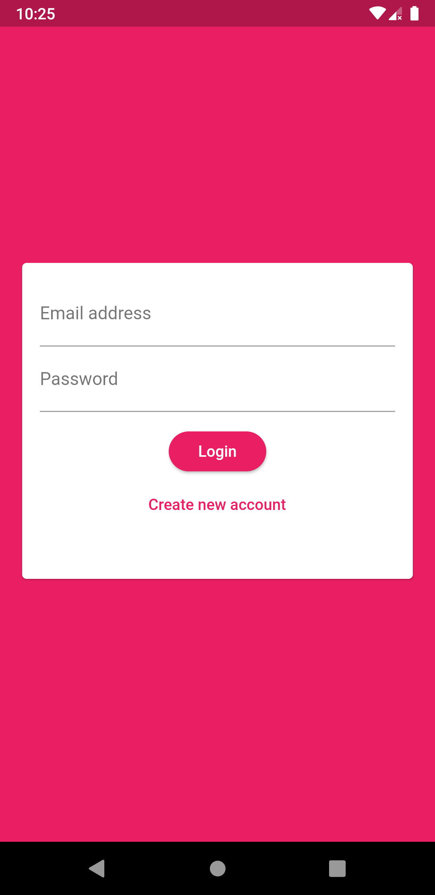
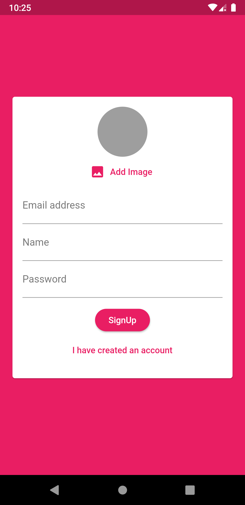
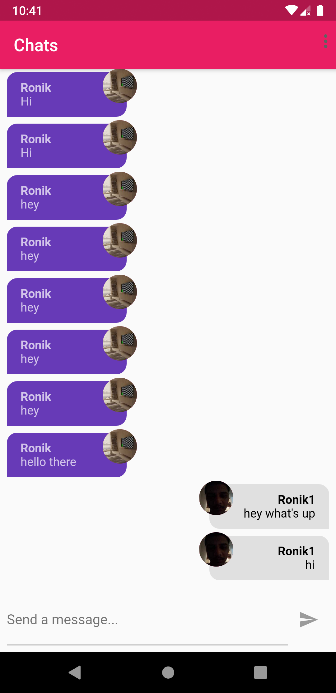
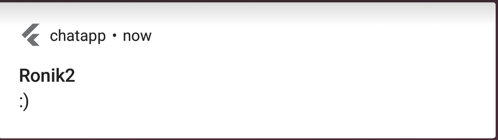

# Chat App

A simple flutter app for chating with each other. This app has :
- An authentication system so that only authenticated users can chat.
- Notifies all the other users when a new message is added by an user. 

## Authentication Screen

    

        
        
    

    

The main points regarding these images :
- Login requires the email address and password to login as shown in 1st figure.
- SignUp requires the email,username,password and an image from the user.
- On tapping on 'add image' button the user is taken to the camera, where he had to capture an image on the fly(means no option to go to gallery and select an image).
- Any error occured while signing up or logining in, a snackbar is shown at the bottom.
- The conditions for signing up are, email should be valid, username should be of a single word with first letter as capital, the password should be atleast 8 characters long and should also be atleast a combination of small and capital letters.

## Chat Screen

    

The main points regarding this screen are :
- A particular user message are shown on the right side. Also the background color of the message bubble is grey.
- All other messages are shown on left side. Also the background color of the message bubble is blue.
- In the message bubble, the upper part of the text(the first line in bold letters), is the username, below is the message and the image is the user image which he clicked while sigining up.
- The message can be written from the text field given at the bottom of the screen.
- At the top right, the button will open a drop down menu which has only one menu option-to logout.Pressing on it will logout the user to the app and will be directed to the login screen. 
## Notification

    

It is the simple notification which has the title as the username and the content as the message.

## Future Improvements
The future improvements are as follows :
- The image can also be improved by adding an option to select from gallery.
- A profile system can be made for the user.
- No private chating among users is possible. Here every message is sent to every other user. Thus private chating between two users can be made possible.
